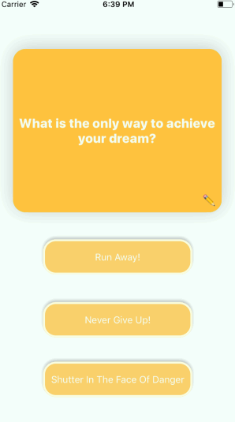

## Flashcards

### App Description
Flashcards is an app that merely tells and reminds you how to achieve your dreams. Simply tap the screen and your one question will be answered.

### App Walk-though

Tap the multiple choice question the you believe is the answer to the question. Once the question is succesfully answered tap the same answer again for a reminder of what the question was.

 

## Required
- [x] User can open the creation screen
- [x] User can cancel out of the creation screen
- [x] User can enter a new question and answer in the creation screen to then show it on the flashcard
- [x] Push code to GitHub
## Optional
- [ ] User gets an error if they try to create a new flashcard with no question or answer
- [ ] User can edit existing flashcard
- [ ] User can add multiple choice answers in the creation screen
